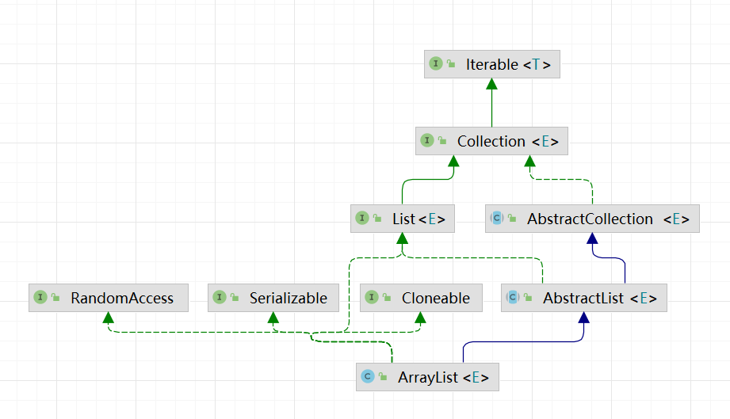

归根结底就是 数组+链表

ArrayList<T>  就是数组，不定长数组，自动扩容，尾插法
LinkedList<T> 是双向链表，头 prev = null，尾部 next = null

hashmap
数组+链表+红黑树

负载因子是为了降低hash碰撞的概率
线程不安全，
多线程下 出现3中情况：

1. rehash 链表头插法，循环链表
2. put 操作，hash相同覆盖
3. get 操作null rehash 过程没有完成